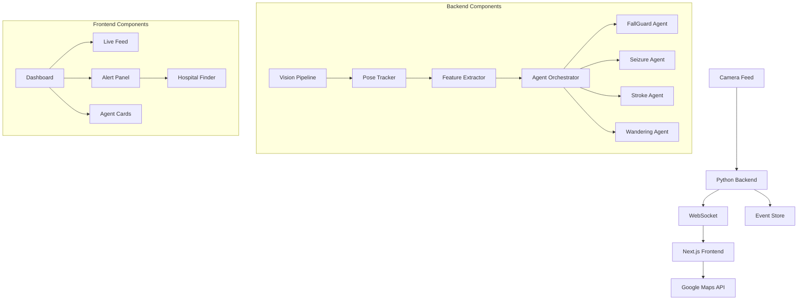
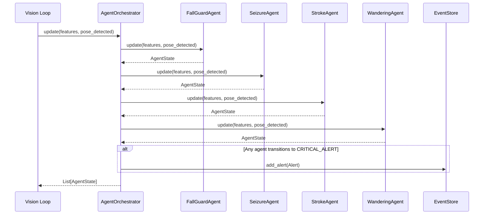
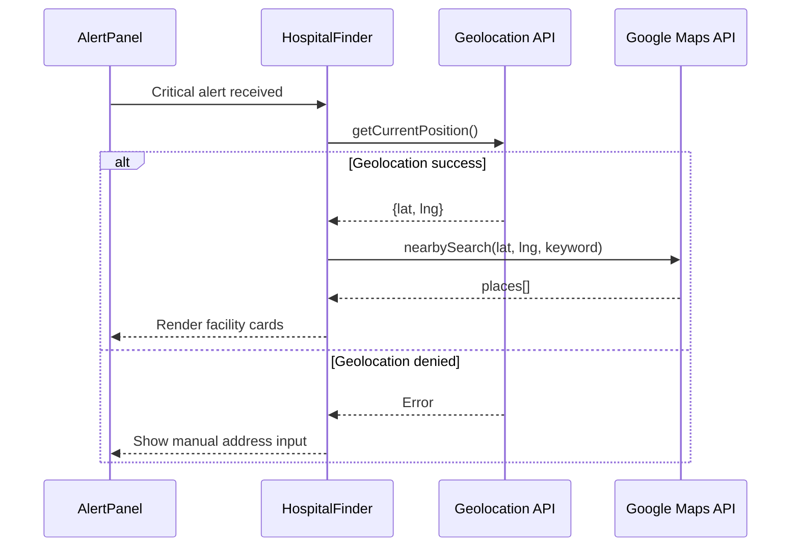
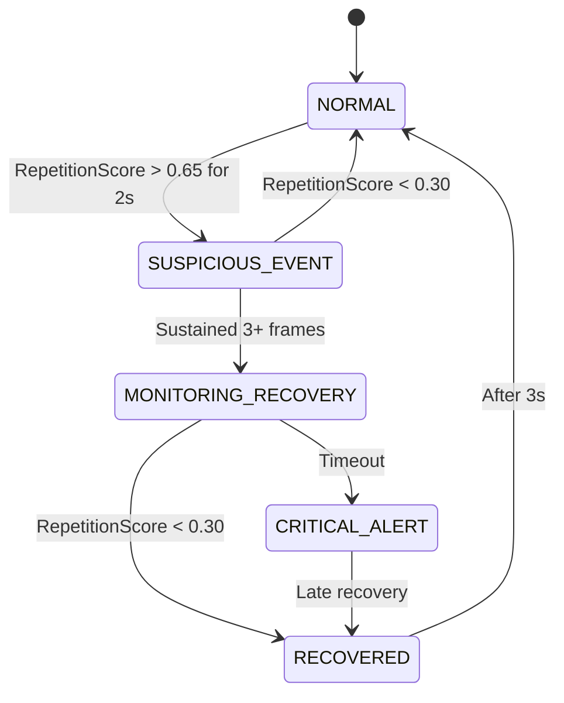
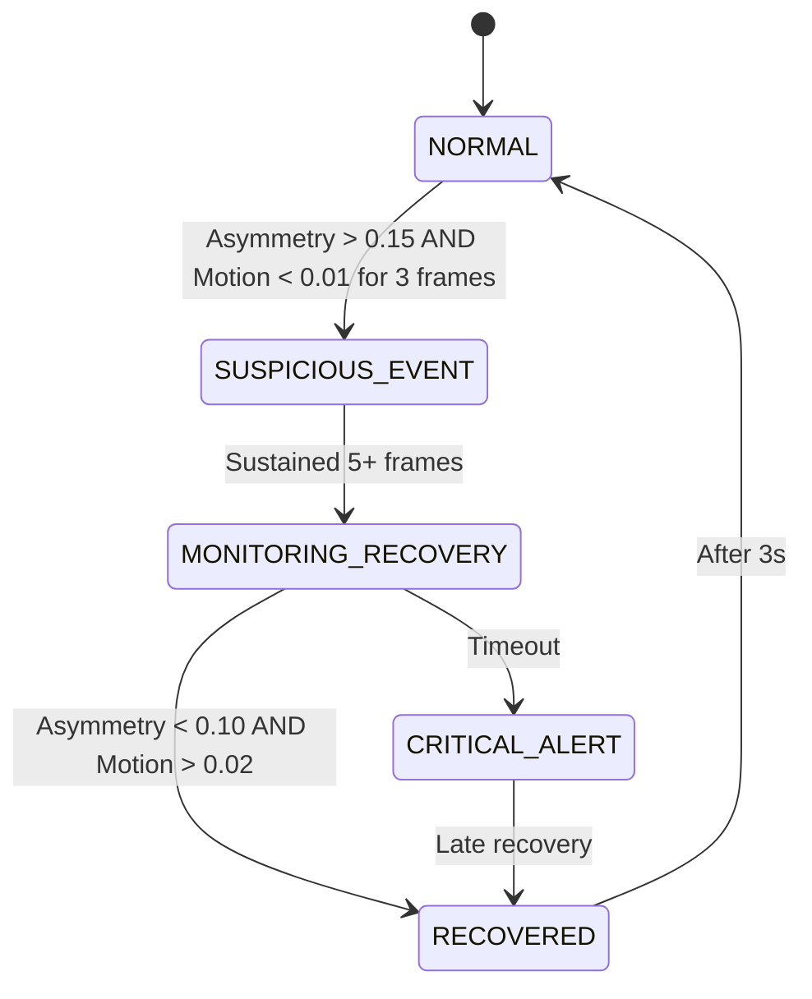
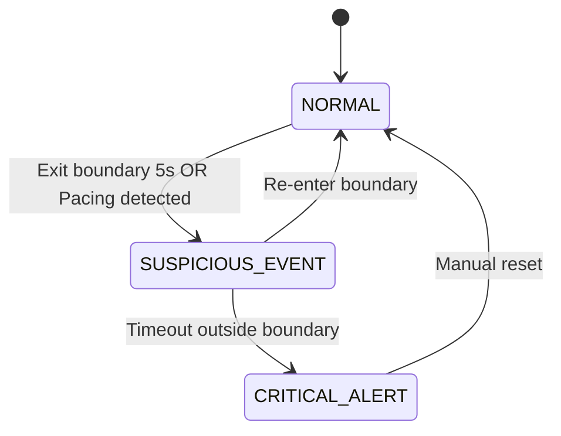

# Design Document: SentinelCare Phase 3

## Overview

This design document specifies the implementation of SentinelCare Phase 3, which adds two major capabilities to the existing fall detection system:

1. **Hospital Finder Integration**: Real-time geolocation-based search for nearest specialist medical facilities using Google Maps Places API, integrated directly into the alert UI
2. **Specialized Detection Agents**: Three new state machine agents (Seizure, Stroke, Wandering) following the existing FallGuardAgent architecture

The design maintains backward compatibility with the existing system while introducing a multi-agent orchestration layer that allows independent agent operation and configuration. Phase 4 requirements (thermal detection, wearable fusion, AWS SNS/S3) are included in this document but marked as future implementation.

### Design Principles

- **Modularity**: Each agent operates independently with its own state machine and configuration
- **Extensibility**: New agents can be added without modifying the core vision loop
- **Backward Compatibility**: Existing FallGuardAgent functionality remains unchanged
- **Privacy-First**: All processing remains local; only hospital search requires external API calls
- **Real-Time Performance**: All agents must process frames at 24 FPS minimum

---

## Architecture

### System Context



### Multi-Agent Architecture

The core architectural change is the introduction of the **AgentOrchestrator**, which manages multiple detection agents running in parallel:



### Hospital Finder Flow



---

## Components and Interfaces

### Backend Components

#### 1. AgentOrchestrator

**Purpose**: Centralized manager for all detection agents, providing a single interface for the vision loop.

**Interface**:
```python
class AgentOrchestrator:
    def __init__(self):
        self._agents: dict[str, BaseAgent] = {}
        
    def register_agent(self, name: str, agent: BaseAgent) -> None:
        """Register a new agent with the orchestrator."""
        
    def update(self, features: PoseFeatures, pose_detected: bool) -> list[AgentState]:
        """Update all agents and return their states."""
        
    def reset_all(self) -> None:
        """Reset all agents to NORMAL state."""
        
    def get_agent(self, name: str) -> BaseAgent | None:
        """Retrieve a specific agent by name."""
```

**Responsibilities**:
- Maintain registry of active agents
- Route frame updates to all registered agents
- Collect and return all agent states
- Detect CRITICAL_ALERT transitions and emit alerts to EventStore
- Provide bulk reset functionality

**Implementation Notes**:
- Agents are stored in an ordered dictionary to maintain consistent ordering
- Each agent's `update()` is called sequentially (not parallelized) to maintain deterministic behavior
- Alert emission is deduplicated: only the first CRITICAL_ALERT transition triggers an alert

#### 2. BaseAgent (Abstract Base Class)

**Purpose**: Define common interface for all detection agents.

**Interface**:
```python
from abc import ABC, abstractmethod

class BaseAgent(ABC):
    def __init__(self, recovery_window: float, confidence_threshold: float):
        self._state = AgentStateName.NORMAL
        self._confidence = 0.0
        self._recovery_window = recovery_window
        self._confidence_threshold = confidence_threshold
        self._timer_start: float | None = None
        self._last_change = time.time()
        
    @abstractmethod
    def update(self, features: PoseFeatures, pose_detected: bool) -> AgentState:
        """Process one frame and return updated state."""
        
    @abstractmethod
    def reset(self) -> None:
        """Reset agent to NORMAL state."""
        
    @abstractmethod
    def get_agent_name(self) -> str:
        """Return the agent's display name."""
```

#### 3. SeizureAgent

**Purpose**: Detect seizure-like repetitive motion patterns.

**Detection Logic**:
- Computes `RepetitionScore` from autocorrelation of vertical joint displacement
- Requires sustained high repetition score (>0.65) for 2+ seconds
- Monitors for recovery (score drops below 0.30)

**State Transitions**:
```
NORMAL → SUSPICIOUS_EVENT (RepetitionScore > 0.65 for 2s)
SUSPICIOUS_EVENT → MONITORING_RECOVERY (sustained for 3+ frames)
MONITORING_RECOVERY → CRITICAL_ALERT (recovery window expires)
MONITORING_RECOVERY → RECOVERED (RepetitionScore < 0.30)
```

**Key Parameters**:
- `recovery_window`: 10.0 seconds (default)
- `confidence_threshold`: 0.65
- `recovery_threshold`: 0.30
- `history_window`: 60 frames (~2.5 seconds at 24 FPS)

#### 4. StrokeAgent

**Purpose**: Detect stroke indicators (facial/limb asymmetry + sudden immobility).

**Detection Logic**:
- Computes `AsymmetryScore` from left/right landmark Y-coordinate differences
- Requires combined condition: high asymmetry (>0.15) AND low motion (<0.01)
- Monitors for recovery (asymmetry <0.10 AND motion >0.02)

**State Transitions**:
```
NORMAL → SUSPICIOUS_EVENT (AsymmetryScore > 0.15 AND motion < 0.01 for 3 frames)
SUSPICIOUS_EVENT → MONITORING_RECOVERY (sustained for 5+ frames)
MONITORING_RECOVERY → CRITICAL_ALERT (recovery window expires)
MONITORING_RECOVERY → RECOVERED (AsymmetryScore < 0.10 AND motion > 0.02)
```

**Key Parameters**:
- `recovery_window`: 15.0 seconds (default, longer than fall detection)
- `asymmetry_threshold`: 0.15
- `motion_threshold`: 0.01
- `recovery_asymmetry_threshold`: 0.10
- `recovery_motion_threshold`: 0.02

#### 5. WanderingAgent

**Purpose**: Detect prolonged pacing or boundary-crossing behavior.

**Detection Logic**:
- Tracks body centroid position relative to configurable `BoundaryZone`
- Detects two patterns:
  1. **Boundary Exit**: Centroid outside zone for >5 seconds
  2. **Pacing**: Centroid crosses midpoint >8 times in 30 seconds

**State Transitions**:
```
NORMAL → SUSPICIOUS_EVENT (exit boundary for 5s OR pacing detected)
SUSPICIOUS_EVENT → NORMAL (re-enter boundary)
SUSPICIOUS_EVENT → CRITICAL_ALERT (remain outside for recovery window)
```

**Key Parameters**:
- `recovery_window`: 20.0 seconds (default)
- `boundary_zone`: `{x1: 0.1, y1: 0.1, x2: 0.9, y2: 0.9}` (default, covers 80% of frame)
- `exit_threshold`: 5.0 seconds
- `pacing_threshold`: 8 crossings in 30 seconds

**Implementation Notes**:
- If `boundary_zone` is `None`, operates in pacing-only mode
- Centroid position is tracked in normalized coordinates [0, 1]
- Pacing detection uses a circular buffer of centroid X positions

#### 6. Enhanced FeatureExtractor

**Purpose**: Compute additional derived features for new agents.

**New Features**:

```python
@dataclass
class PoseFeatures:
    # Existing features
    body_centroid_y: float = 0.0
    torso_angle: float = 0.0
    head_height: float = 0.0
    hip_height: float = 0.0
    velocity: float = 0.0
    motion_energy: float = 0.0
    stillness_score: float = 0.0
    ground_proximity: float = 0.0
    
    # New features for Phase 3
    repetition_score: float = 0.0  # For SeizureAgent
    asymmetry_score: float = 0.0   # For StrokeAgent
    body_centroid_x: float = 0.0   # For WanderingAgent
```

**RepetitionScore Computation**:
1. Maintain 60-frame rolling window of per-joint vertical displacement
2. Compute autocorrelation at lag=12 frames (~0.5 seconds at 24 FPS)
3. Normalize to [0, 1] range
4. High score indicates periodic oscillation

**AsymmetryScore Computation**:
1. For each bilateral landmark pair (shoulders, hips, wrists, elbows):
   - Compute absolute Y-coordinate difference
   - Normalize by frame height
2. Average across all pairs
3. Result in [0, 1] range where 0 = perfect symmetry

### Frontend Components

#### 1. HospitalFinder Service

**Purpose**: Geolocation and Google Maps Places API integration.

**Interface**:
```typescript
interface HospitalFinderService {
  findNearestFacilities(
    eventType: string,
    onProgress: (status: string) => void
  ): Promise<FacilityResult[]>;
  
  getManualSearch(address: string, eventType: string): Promise<FacilityResult[]>;
}

interface FacilityResult {
  name: string;
  distance: number;  // kilometers
  rating?: number;
  placeId: string;
  address: string;
}
```

**Event Type Mapping**:
```typescript
const FACILITY_KEYWORDS: Record<string, string> = {
  'fall_collapse': 'trauma center',
  'collapse_no_recovery': 'trauma center',
  'seizure_suspected': 'neurological center',
  'stroke_suspected': 'stroke center',
  'wandering_detected': 'memory care',
  'test_alert': 'hospital',
};
```

**Implementation Flow**:
1. Request geolocation with 10s timeout, 300s max age
2. Cache coordinates in sessionStorage
3. Call Places Nearby Search API with mapped keyword
4. Parse results, compute distances using Haversine formula
5. Sort by distance, return top 3
6. Fallback to 50km radius if no results within 25km

#### 2. Enhanced AlertPanel Component

**Purpose**: Display critical alerts with integrated hospital finder results.

**New Structure**:
```typescript
interface AlertPanelProps {
  alert: Alert | null;
  onAcknowledge: () => void;
}

// Internal state
interface AlertPanelState {
  facilities: FacilityResult[];
  loadingFacilities: boolean;
  facilityError: string | null;
}
```

**Rendering Sections**:
1. Alert header (event type, confidence, timestamp)
2. Recommended action block
3. **NEW**: Nearest Facilities section
   - Loading skeleton while fetching
   - Facility cards with name, distance, rating, directions button
   - Error fallback: "Unable to load results. Call 911 immediately."
4. Acknowledge button

#### 3. AgentCard Component

**Purpose**: Display live status for each active agent.

**Interface**:
```typescript
interface AgentCardProps {
  agentState: AgentState;
}

interface AgentState {
  agent_name: string;
  state: AgentStateName;
  confidence: number;
  event_type: string;
  timer_active: boolean;
  timer_remaining: number;
  timer_total: number;
  last_change: string;
  summary: string;
}
```

**Visual States**:
- `NORMAL`: Gray border, checkmark icon, "Monitoring" badge
- `SUSPICIOUS_EVENT`: Yellow border, warning icon, "Evaluating" badge
- `MONITORING_RECOVERY`: Orange border, clock icon, countdown timer
- `RECOVERED`: Green border, checkmark icon, "Recovered" badge
- `CRITICAL_ALERT`: Red pulsing border, alert icon, "CRITICAL" badge

---

## Data Models

### Backend Models (Pydantic)

#### Enhanced WSMessage

```python
class WSMessage(BaseModel):
    type: str
    frame: Optional[str] = None
    
    # Backward compatibility: single agent state
    agent_state: Optional[AgentState] = None
    
    # New: multi-agent support
    agents: list[AgentState] = Field(default_factory=list)
    
    features: Optional[PoseFeatures] = None
    event: Optional[Event] = None
    alert: Optional[Alert] = None
    pose_detected: bool = False
    num_people: int = 0
```

#### Enhanced AgentState

```python
class AgentState(BaseModel):
    agent_name: str = "Unknown"  # NEW
    state: AgentStateName = AgentStateName.NORMAL
    confidence: float = 0.0
    event_type: str = "none"
    timer_active: bool = False
    timer_remaining: float = 0.0
    timer_total: float = 10.0
    last_change: str = Field(default_factory=lambda: datetime.now(timezone.utc).isoformat())
    summary: str = "System operating normally."
```

#### Per-Agent Configuration

```python
class SeizureConfig(BaseModel):
    recovery_window: float = 10.0
    confidence_threshold: float = 0.65
    recovery_threshold: float = 0.30
    history_window: int = 60

class StrokeConfig(BaseModel):
    recovery_window: float = 15.0
    asymmetry_threshold: float = 0.15
    motion_threshold: float = 0.01
    recovery_asymmetry_threshold: float = 0.10
    recovery_motion_threshold: float = 0.02

class WanderingConfig(BaseModel):
    recovery_window: float = 20.0
    boundary_zone: Optional[dict[str, float]] = Field(
        default_factory=lambda: {"x1": 0.1, "y1": 0.1, "x2": 0.9, "y2": 0.9}
    )
    exit_threshold: float = 5.0
    pacing_threshold: int = 8
    pacing_window: float = 30.0

class AppConfig(BaseModel):
    # Existing fields
    video_source: str = "0"
    recovery_window: float = 10.0
    location_label: str = "Living Room"
    fall_confidence_threshold: float = 0.55
    show_pose_overlay: bool = True
    frame_skip: int = 0
    
    # New per-agent configs
    seizure_config: SeizureConfig = Field(default_factory=SeizureConfig)
    stroke_config: StrokeConfig = Field(default_factory=StrokeConfig)
    wandering_config: WanderingConfig = Field(default_factory=WanderingConfig)
```

### Frontend Models (TypeScript)

```typescript
interface FacilityResult {
  name: string;
  distance: number;
  rating?: number;
  placeId: string;
  address: string;
}

interface GeolocationState {
  coords: { lat: number; lng: number } | null;
  error: string | null;
  loading: boolean;
}

interface AgentState {
  agent_name: string;
  state: 'normal' | 'suspicious_event' | 'monitoring_recovery' | 'recovered' | 'critical_alert';
  confidence: number;
  event_type: string;
  timer_active: boolean;
  timer_remaining: number;
  timer_total: number;
  last_change: string;
  summary: string;
}

interface WSMessage {
  type: string;
  frame?: string;
  agent_state?: AgentState;  // Backward compatibility
  agents?: AgentState[];     // Multi-agent support
  features?: PoseFeatures;
  event?: Event;
  alert?: Alert;
  pose_detected: boolean;
  num_people: number;
}
```

---

## Correctness Properties

### Property-Based Testing Applicability Assessment

This feature involves multiple components with different testing needs:

**Components suitable for PBT:**
- **Agent state machines**: Pure logic with clear input/output behavior (PoseFeatures → AgentState)
- **Feature extraction**: Mathematical transformations (landmarks → derived features)
- **Asymmetry/repetition score computation**: Deterministic algorithms on structured data

**Components NOT suitable for PBT:**
- **Google Maps API integration**: External service calls (use integration tests with mocks)
- **WebSocket broadcasting**: I/O and network operations (use integration tests)
- **React component rendering**: UI behavior (use snapshot tests and example-based tests)
- **Geolocation API**: Browser API with side effects (use mocks and example tests)

**Decision**: Property-based testing IS appropriate for the core agent logic and feature extraction algorithms. We will write properties for these components while using example-based and integration tests for I/O boundaries.

---

*A property is a characteristic or behavior that should hold true across all valid executions of a system—essentially, a formal statement about what the system should do. Properties serve as the bridge between human-readable specifications and machine-verifiable correctness guarantees.*


### Property Reflection

After analyzing all acceptance criteria, I've identified the following consolidation opportunities:

**Redundancies to eliminate:**
1. **Agent event metadata** (2.7, 3.6, 4.6): All three agents set event_type - can be combined into one property about agent event consistency
2. **Agent recommended actions** (2.8, 3.7, 4.7): All three agents set recommended_action on CRITICAL_ALERT - can be combined
3. **State transition patterns**: Multiple criteria test the same state machine pattern (NORMAL → SUSPICIOUS → MONITORING → CRITICAL/RECOVERED) - can be generalized
4. **Score bounds**: RepetitionScore and AsymmetryScore both must be in [0, 1] - can be combined into one property about feature bounds
5. **WSMessage schema** (1.5, 5.1, 5.2): Multiple criteria test the same data structure - can be combined
6. **Agent list completeness** (5.3, 5.5): Both test that agents list matches registered agents - redundant

**Properties to combine:**
- Combine all "agent SHALL transition to MONITORING_RECOVERY" criteria into one property about state machine progression
- Combine all "agent SHALL transition to CRITICAL_ALERT on timeout" into one property about recovery window behavior
- Combine all "agent SHALL transition to RECOVERED" into one property about recovery detection
- Combine configuration schema tests (10.1, 10.2, 10.5) into one property about config completeness

**Result**: Reduced from 60+ potential properties to ~25 unique, non-redundant properties that provide comprehensive coverage.

---

### Property 1: Agent Orchestrator Registration Completeness

*For any* set of agents registered with the AgentOrchestrator, calling `update()` SHALL return a list of AgentState objects with length equal to the number of registered agents, and each AgentState SHALL have a unique `agent_name` matching a registered agent.

**Validates: Requirements 1.1, 1.2, 5.3, 5.5**

---

### Property 2: Agent Orchestrator Reset Propagation

*For any* AgentOrchestrator with registered agents in any combination of states, calling `reset_all()` SHALL result in all agents returning to `NORMAL` state with `confidence` of 0.0 on the next `update()` call.

**Validates: Requirements 1.3, 11.1, 11.2, 11.3**

---

### Property 3: Critical Alert Emission Uniqueness

*For any* agent transitioning from a non-CRITICAL_ALERT state to CRITICAL_ALERT state, the AgentOrchestrator SHALL emit exactly one Alert to the EventStore for that transition, and SHALL NOT emit duplicate alerts for the same agent remaining in CRITICAL_ALERT state.

**Validates: Requirements 1.4**

---

### Property 4: WSMessage Multi-Agent Schema Completeness

*For any* WSMessage with N registered agents, the `agents` list SHALL contain exactly N AgentState objects, each with a non-empty `agent_name` field, AND the top-level `agent_state` field SHALL equal the AgentState of the agent named "FallGuard" (backward compatibility).

**Validates: Requirements 1.5, 5.1, 5.2, 5.4**

---

### Property 5: Feature Score Bounds Invariant

*For any* valid PoseFeatures computed from pose landmarks, the `RepetitionScore` and `AsymmetryScore` SHALL both be floats in the range [0.0, 1.0] inclusive.

**Validates: Requirements 2.1, 3.1, 3.8**

---

### Property 6: RepetitionScore Periodicity Correlation

*For any* sequence of pose landmarks with perfectly periodic vertical joint displacement (sine wave with period P), the computed `RepetitionScore` SHALL be higher than the score for a random sequence of the same length.

**Validates: Requirements 2.1**

---

### Property 7: AsymmetryScore Symmetry Correlation

*For any* pair of pose landmark sequences where one is perfectly symmetric (left landmarks mirror right landmarks) and one is asymmetric (left and right differ by >0.2 in Y-coordinates), the symmetric sequence SHALL produce a lower `AsymmetryScore` than the asymmetric sequence.

**Validates: Requirements 3.1**

---

### Property 8: SeizureAgent Suspicious Event Transition

*For any* SeizureAgent in NORMAL state receiving PoseFeatures with `RepetitionScore` > 0.65 for at least 48 consecutive frames (2 seconds at 24 FPS), the agent SHALL transition to SUSPICIOUS_EVENT state.

**Validates: Requirements 2.2**

---

### Property 9: SeizureAgent Monitoring Transition

*For any* SeizureAgent in SUSPICIOUS_EVENT state receiving PoseFeatures with `RepetitionScore` > 0.65 for 3 or more additional frames, the agent SHALL transition to MONITORING_RECOVERY state.

**Validates: Requirements 2.3**

---

### Property 10: SeizureAgent Recovery Detection

*For any* SeizureAgent in MONITORING_RECOVERY state, if `RepetitionScore` drops below 0.30 before the recovery window elapses, the agent SHALL transition to RECOVERED state.

**Validates: Requirements 2.5**

---

### Property 11: SeizureAgent Critical Alert on Timeout

*For any* SeizureAgent in MONITORING_RECOVERY state, if `RepetitionScore` remains above 0.30 for the entire recovery window duration, the agent SHALL transition to CRITICAL_ALERT state.

**Validates: Requirements 2.4**

---

### Property 12: SeizureAgent False Alarm Handling

*For any* SeizureAgent in SUSPICIOUS_EVENT state, if `RepetitionScore` drops below 0.30, the agent SHALL transition back to NORMAL state without emitting any Event to the EventStore.

**Validates: Requirements 2.6**

---

### Property 13: StrokeAgent Suspicious Event Transition

*For any* StrokeAgent in NORMAL state receiving PoseFeatures with `AsymmetryScore` > 0.15 AND `motion_energy` < 0.01 for at least 3 consecutive frames, the agent SHALL transition to SUSPICIOUS_EVENT state.

**Validates: Requirements 3.2**

---

### Property 14: StrokeAgent Monitoring Transition

*For any* StrokeAgent in SUSPICIOUS_EVENT state receiving PoseFeatures with `AsymmetryScore` > 0.15 AND `motion_energy` < 0.01 for 5 or more additional frames, the agent SHALL transition to MONITORING_RECOVERY state.

**Validates: Requirements 3.3**

---

### Property 15: StrokeAgent Recovery Detection

*For any* StrokeAgent in MONITORING_RECOVERY state, if `AsymmetryScore` drops below 0.10 AND `motion_energy` rises above 0.02 before the recovery window elapses, the agent SHALL transition to RECOVERED state.

**Validates: Requirements 3.5**

---

### Property 16: StrokeAgent Critical Alert on Timeout

*For any* StrokeAgent in MONITORING_RECOVERY state, if the recovery window elapses without `AsymmetryScore` dropping below 0.10 AND `motion_energy` rising above 0.02, the agent SHALL transition to CRITICAL_ALERT state.

**Validates: Requirements 3.4**

---

### Property 17: WanderingAgent Boundary Exit Detection

*For any* WanderingAgent with a configured BoundaryZone, if the subject's `body_centroid_x` and `body_centroid_y` remain outside the boundary for more than 5 consecutive seconds, the agent SHALL transition from NORMAL to SUSPICIOUS_EVENT state.

**Validates: Requirements 4.2**

---

### Property 18: WanderingAgent Boundary Re-entry Recovery

*For any* WanderingAgent tracking a boundary exit, if the subject's centroid re-enters the BoundaryZone, the agent SHALL transition back to NORMAL state and reset the exit timer to 0.

**Validates: Requirements 4.3**

---

### Property 19: WanderingAgent Sustained Exit Alert

*For any* WanderingAgent in SUSPICIOUS_EVENT state due to boundary exit, if the subject remains outside the BoundaryZone for the entire recovery window, the agent SHALL transition to CRITICAL_ALERT state.

**Validates: Requirements 4.4**

---

### Property 20: WanderingAgent Pacing Detection

*For any* WanderingAgent receiving a sequence of `body_centroid_x` values that cross a midpoint threshold more than 8 times within a 30-second window, the agent SHALL transition from NORMAL to SUSPICIOUS_EVENT state.

**Validates: Requirements 4.5**

---

### Property 21: WanderingAgent Pacing-Only Mode

*For any* WanderingAgent with `boundary_zone` set to None, the agent SHALL NOT emit any boundary-exit events regardless of centroid position, and SHALL only detect pacing patterns.

**Validates: Requirements 4.8**

---

### Property 22: Agent Event Metadata Consistency

*For any* Event emitted by SeizureAgent, StrokeAgent, or WanderingAgent, the `event_type` field SHALL match the agent's designated event type ("seizure_suspected", "stroke_suspected", or "wandering_detected" respectively), and all CRITICAL_ALERT events SHALL include a non-empty `recommended_action` field.

**Validates: Requirements 2.7, 2.8, 3.6, 3.7, 4.6, 4.7**

---

### Property 23: Event Type to Facility Keyword Mapping

*For any* event_type string in the system's event type enumeration, the HospitalFinder SHALL map it to exactly one Specialist Facility Type keyword, with unmapped types defaulting to "hospital".

**Validates: Requirements 7.1**

---

### Property 24: Hospital Search Radius Retry

*For any* Google Maps Places API query that returns zero results within a 25,000-meter radius, the HospitalFinder SHALL automatically retry the same query with a 50,000-meter radius.

**Validates: Requirements 7.4**

---

### Property 25: Geolocation Caching Round-Trip

*For any* successful geolocation result with coordinates {lat, lng}, storing the coordinates in sessionStorage and then retrieving them SHALL produce the same coordinate values (within floating-point precision).

**Validates: Requirements 6.3**

---

### Property 26: AppConfig Per-Agent Block Completeness

*For any* AppConfig instance, the object SHALL include `seizure_config`, `stroke_config`, and `wandering_config` fields, each containing at minimum a `recovery_window` and `confidence_threshold` field.

**Validates: Requirements 10.1, 10.2, 10.5**

---

### Property 27: AppConfig Partial Update Preservation

*For any* AppConfig POST request that omits one or more per-agent configuration blocks, a subsequent GET request SHALL return those omitted blocks with their previous values unchanged.

**Validates: Requirements 10.4**

---

### Property 28: Configuration Update Application

*For any* valid AppConfig POST request with updated threshold values, all registered agents SHALL use the new threshold values on the next `update()` call after the POST completes.

**Validates: Requirements 10.3**

---

### Property 29: AgentCard Rendering Count

*For any* WebSocket message containing an `agents` list of length N, the Frontend SHALL render exactly N AgentCard components, each displaying data from one unique AgentState.

**Validates: Requirements 9.1, 9.5**

---

### Property 30: AlertPanel Facility Card Completeness

*For any* FacilityResult object rendered in the AlertPanel, the rendered card SHALL display all required fields: name, distance (in km), rating (if available), and a "Get Directions" button with a valid Google Maps URL.

**Validates: Requirements 8.3**

---

### Property 31: AlertPanel Accessibility Compliance

*For any* interactive element (button, link, input) rendered in the AlertPanel component, the element SHALL have a descriptive `aria-label` or `aria-labelledby` attribute.

**Validates: Requirements 8.6**

---

## Error Handling

### Backend Error Handling

#### Agent Orchestrator Errors

**Scenario**: Agent registration with duplicate name
- **Handling**: Raise `ValueError` with descriptive message
- **Recovery**: Caller must use unique agent names

**Scenario**: Agent `update()` raises exception
- **Handling**: Log exception with agent name, return last known state for that agent, continue processing other agents
- **Recovery**: Agent remains in last valid state until next successful update

**Scenario**: EventStore full (memory limit reached)
- **Handling**: Log warning, drop oldest events (FIFO), continue operation
- **Recovery**: Automatic - oldest events are evicted

#### Agent State Machine Errors

**Scenario**: Invalid PoseFeatures (NaN, Inf values)
- **Handling**: Treat as `pose_detected=False`, agent remains in current state
- **Recovery**: Automatic on next valid frame

**Scenario**: Timer overflow (recovery_window exceeded system time limits)
- **Handling**: Clamp timer to maximum safe value (86400 seconds = 24 hours)
- **Recovery**: Automatic - timer continues from clamped value

**Scenario**: Configuration validation failure (negative thresholds, invalid boundary coordinates)
- **Handling**: Reject POST request with HTTP 422, return validation error details
- **Recovery**: Client must correct configuration and retry

#### Feature Extraction Errors

**Scenario**: Insufficient landmarks (< 33 landmarks)
- **Handling**: Return default PoseFeatures with all scores at 0.0
- **Recovery**: Automatic on next frame with sufficient landmarks

**Scenario**: Landmark visibility too low (< 0.5)
- **Handling**: Exclude low-visibility landmarks from feature computation, use only high-confidence landmarks
- **Recovery**: Automatic - features computed from available high-confidence landmarks

**Scenario**: Division by zero in angle/ratio calculations
- **Handling**: Return 0.0 for that specific feature, continue with other features
- **Recovery**: Automatic on next frame

### Frontend Error Handling

#### Geolocation Errors

**Scenario**: User denies geolocation permission
- **Handling**: Display manual address input field with clear instructions
- **Recovery**: User enters address manually, system geocodes address to coordinates

**Scenario**: Geolocation timeout (> 10 seconds)
- **Handling**: Display error message: "Location unavailable. Please enter address manually."
- **Recovery**: Fallback to manual address input

**Scenario**: Geolocation not supported by browser
- **Handling**: Skip geolocation attempt, immediately show manual address input
- **Recovery**: User provides address manually

#### Google Maps API Errors

**Scenario**: Invalid API key
- **Handling**: Display fallback message: "Unable to load hospital results. Call 911 immediately."
- **Recovery**: Manual - administrator must configure valid API key

**Scenario**: API quota exceeded
- **Handling**: Display fallback message with 911 instruction, log error for administrator
- **Recovery**: Manual - administrator must increase quota or wait for quota reset

**Scenario**: Network timeout (> 5 seconds)
- **Handling**: Display error: "Network error. Retrying..." Retry once after 2 seconds.
- **Recovery**: Automatic retry, then fallback to 911 message if retry fails

**Scenario**: Zero results within 50km radius
- **Handling**: Display message: "No facilities found nearby. Call 911 for emergency assistance."
- **Recovery**: None - user must call emergency services

#### WebSocket Errors

**Scenario**: WebSocket connection lost
- **Handling**: Display "Reconnecting..." overlay on LiveFeed, attempt reconnection every 3 seconds
- **Recovery**: Automatic reconnection with exponential backoff (max 30 seconds)

**Scenario**: Malformed WebSocket message
- **Handling**: Log error to console, ignore message, continue processing subsequent messages
- **Recovery**: Automatic - next valid message is processed normally

**Scenario**: WebSocket message too large (> 10MB)
- **Handling**: Log error, skip frame rendering, continue with next message
- **Recovery**: Automatic - backend should never send messages this large (indicates bug)

#### Component Rendering Errors

**Scenario**: React component throws exception during render
- **Handling**: Error boundary catches exception, displays fallback UI: "Component error. Refresh page."
- **Recovery**: User refreshes page to reset component state

**Scenario**: Invalid AgentState data (missing required fields)
- **Handling**: Display placeholder card with "Data unavailable" message for that agent
- **Recovery**: Automatic on next valid WebSocket message

---

## Testing Strategy

### Overview

This feature requires a dual testing approach combining property-based testing for core agent logic and feature extraction with example-based and integration tests for I/O boundaries and UI components.

### Property-Based Testing

**Library**: `hypothesis` (Python backend), `fast-check` (TypeScript frontend)

**Minimum Iterations**: 100 per property test (due to randomization)

**Tag Format**: Each property test must include a comment referencing the design property:
```python
# Feature: sentinelcare-phase3, Property 1: Agent Orchestrator Registration Completeness
```

#### Backend Property Tests

**Test Suite**: `tests/property/test_agent_orchestrator.py`
- Property 1: Registration completeness
- Property 2: Reset propagation
- Property 3: Critical alert emission uniqueness
- Property 4: WSMessage schema completeness

**Test Suite**: `tests/property/test_feature_extraction.py`
- Property 5: Feature score bounds invariant
- Property 6: RepetitionScore periodicity correlation
- Property 7: AsymmetryScore symmetry correlation

**Test Suite**: `tests/property/test_seizure_agent.py`
- Property 8: Suspicious event transition
- Property 9: Monitoring transition
- Property 10: Recovery detection
- Property 11: Critical alert on timeout
- Property 12: False alarm handling
- Property 22: Event metadata consistency (SeizureAgent portion)

**Test Suite**: `tests/property/test_stroke_agent.py`
- Property 13: Suspicious event transition
- Property 14: Monitoring transition
- Property 15: Recovery detection
- Property 16: Critical alert on timeout
- Property 22: Event metadata consistency (StrokeAgent portion)

**Test Suite**: `tests/property/test_wandering_agent.py`
- Property 17: Boundary exit detection
- Property 18: Boundary re-entry recovery
- Property 19: Sustained exit alert
- Property 20: Pacing detection
- Property 21: Pacing-only mode
- Property 22: Event metadata consistency (WanderingAgent portion)

**Test Suite**: `tests/property/test_config.py`
- Property 26: AppConfig per-agent block completeness
- Property 27: Partial update preservation
- Property 28: Configuration update application

#### Frontend Property Tests

**Test Suite**: `tests/property/test_hospital_finder.ts`
- Property 23: Event type to facility keyword mapping
- Property 24: Hospital search radius retry
- Property 25: Geolocation caching round-trip

**Test Suite**: `tests/property/test_agent_card.tsx`
- Property 29: AgentCard rendering count

**Test Suite**: `tests/property/test_alert_panel.tsx`
- Property 30: Facility card completeness
- Property 31: Accessibility compliance

### Example-Based Unit Tests

#### Backend Unit Tests

**Test Suite**: `tests/unit/test_agents.py`
- Test each agent with specific known sequences (e.g., known fall pattern, known seizure pattern)
- Test edge cases: exactly at threshold, one frame below threshold
- Test state persistence across multiple frames
- Test timer accuracy

**Test Suite**: `tests/unit/test_event_store.py`
- Test event/alert CRUD operations
- Test limit enforcement
- Test thread safety (concurrent adds)

**Test Suite**: `tests/unit/test_models.py`
- Test Pydantic model validation
- Test serialization/deserialization
- Test default values

#### Frontend Unit Tests

**Test Suite**: `tests/unit/HospitalFinder.test.ts`
- Test geolocation permission denied → manual input
- Test geolocation timeout → manual input
- Test API error → fallback message
- Test zero results → retry with larger radius
- Test successful search → top 3 results

**Test Suite**: `tests/unit/AlertPanel.test.tsx`
- Test CRITICAL_ALERT received → facilities section appears
- Test loading state → skeleton displayed
- Test results available → cards rendered
- Test acknowledge button → WebSocket message sent
- Test accessibility: all buttons have aria-labels

**Test Suite**: `tests/unit/AgentCard.test.tsx`
- Test NORMAL state → gray border, checkmark
- Test SUSPICIOUS_EVENT state → yellow border, warning icon
- Test MONITORING_RECOVERY state → countdown timer
- Test CRITICAL_ALERT state → red pulsing border
- Test RECOVERED state → green border

### Integration Tests

#### Backend Integration Tests

**Test Suite**: `tests/integration/test_vision_loop.py`
- Test full pipeline: video frame → pose → features → agents → WebSocket broadcast
- Test multi-agent coordination: multiple agents in different states
- Test alert emission: CRITICAL_ALERT triggers EventStore alert
- Test configuration hot-reload: POST /config updates running agents

**Test Suite**: `tests/integration/test_websocket.py`
- Test client connection/disconnection
- Test message broadcasting to multiple clients
- Test reset_agent message handling
- Test malformed message handling

#### Frontend Integration Tests

**Test Suite**: `tests/integration/Dashboard.test.tsx`
- Test WebSocket connection → live feed appears
- Test CRITICAL_ALERT received → AlertPanel opens with hospital finder
- Test multiple agents → multiple AgentCards rendered
- Test acknowledge alert → reset message sent, panel closes

**Test Suite**: `tests/integration/HospitalFinder.integration.test.ts`
- Test with mocked Google Maps API
- Test geolocation → API call → results rendered
- Test manual address → geocoding → API call → results
- Test network error → retry → fallback message

### End-to-End Tests

**Test Suite**: `tests/e2e/test_full_workflow.py`
- Test complete fall detection workflow: normal → suspicious → monitoring → critical → alert with hospital results
- Test complete seizure detection workflow
- Test complete stroke detection workflow
- Test complete wandering detection workflow
- Test multi-agent scenario: fall + wandering simultaneously
- Test configuration change: update thresholds, verify behavior changes
- Test reset: acknowledge alert, verify all agents return to normal

### Performance Tests

**Test Suite**: `tests/performance/test_frame_rate.py`
- Test vision loop maintains 24 FPS with all agents active
- Test WebSocket broadcast latency < 50ms
- Test feature extraction time < 10ms per frame
- Test agent update time < 5ms per agent per frame

**Test Suite**: `tests/performance/test_hospital_finder.ts`
- Test geolocation + API call completes within 5 seconds
- Test caching reduces subsequent search time to < 500ms

### Test Data Generators

#### Hypothesis Strategies (Python)

```python
from hypothesis import strategies as st

@st.composite
def pose_features(draw):
    """Generate valid PoseFeatures."""
    return PoseFeatures(
        body_centroid_y=draw(st.floats(min_value=0.0, max_value=1.0)),
        torso_angle=draw(st.floats(min_value=0.0, max_value=90.0)),
        velocity=draw(st.floats(min_value=-0.5, max_value=0.5)),
        motion_energy=draw(st.floats(min_value=0.0, max_value=1.0)),
        ground_proximity=draw(st.floats(min_value=0.0, max_value=1.0)),
        repetition_score=draw(st.floats(min_value=0.0, max_value=1.0)),
        asymmetry_score=draw(st.floats(min_value=0.0, max_value=1.0)),
        body_centroid_x=draw(st.floats(min_value=0.0, max_value=1.0)),
    )

@st.composite
def periodic_sequence(draw, period=12, amplitude=0.3):
    """Generate periodic vertical displacement sequence."""
    length = draw(st.integers(min_value=60, max_value=120))
    return [amplitude * math.sin(2 * math.pi * i / period) for i in range(length)]

@st.composite
def asymmetric_landmarks(draw):
    """Generate landmarks with left/right asymmetry."""
    asymmetry = draw(st.floats(min_value=0.2, max_value=0.5))
    # Generate left landmarks, then offset right landmarks by asymmetry
    # ... implementation details
```

#### Fast-Check Arbitraries (TypeScript)

```typescript
import * as fc from 'fast-check';

const agentStateArb = fc.record({
  agent_name: fc.constantFrom('FallGuard', 'Seizure', 'Stroke', 'Wandering'),
  state: fc.constantFrom('normal', 'suspicious_event', 'monitoring_recovery', 'recovered', 'critical_alert'),
  confidence: fc.float({ min: 0, max: 1 }),
  event_type: fc.string(),
  timer_active: fc.boolean(),
  timer_remaining: fc.float({ min: 0, max: 30 }),
  timer_total: fc.float({ min: 5, max: 30 }),
  last_change: fc.date().map(d => d.toISOString()),
  summary: fc.string(),
});

const facilityResultArb = fc.record({
  name: fc.string({ minLength: 5 }),
  distance: fc.float({ min: 0.1, max: 100 }),
  rating: fc.option(fc.float({ min: 1, max: 5 })),
  placeId: fc.hexaString({ minLength: 16, maxLength: 32 }),
  address: fc.string({ minLength: 10 }),
});
```

### Test Coverage Goals

- **Backend**: 90% line coverage, 85% branch coverage
- **Frontend**: 85% line coverage, 80% branch coverage
- **Property tests**: All 31 properties must pass with 100 iterations minimum
- **Integration tests**: All critical paths covered (alert workflows, configuration updates, WebSocket communication)
- **E2E tests**: All user-facing workflows covered (detection → alert → hospital finder → acknowledge)

### Continuous Integration

**CI Pipeline**:
1. Lint (flake8, eslint)
2. Type check (mypy, TypeScript compiler)
3. Unit tests (pytest, jest)
4. Property tests (hypothesis, fast-check) - run with 100 iterations
5. Integration tests
6. E2E tests (Playwright)
7. Coverage report (fail if below thresholds)

**Test Execution Time Targets**:
- Unit tests: < 30 seconds
- Property tests: < 2 minutes (parallelized)
- Integration tests: < 1 minute
- E2E tests: < 3 minutes
- Total CI time: < 7 minutes

---

## Implementation Notes

### Phase 3 Implementation Order

1. **Backend Foundation** (Week 1)
   - Implement BaseAgent abstract class
   - Implement AgentOrchestrator
   - Extend PoseFeatures with new fields
   - Update FeatureExtractor with RepetitionScore and AsymmetryScore

2. **Specialized Agents** (Week 2)
   - Implement SeizureAgent
   - Implement StrokeAgent
   - Implement WanderingAgent
   - Write property tests for all agents

3. **Backend Integration** (Week 3)
   - Update main.py vision loop to use AgentOrchestrator
   - Extend WSMessage and AgentState models
   - Update /config endpoint for per-agent configuration
   - Add /agent/reset endpoint

4. **Frontend Hospital Finder** (Week 4)
   - Implement HospitalFinder service
   - Add geolocation handling
   - Integrate Google Maps Places API
   - Add facility keyword mapping

5. **Frontend UI Components** (Week 5)
   - Update AlertPanel with Nearest Facilities section
   - Implement AgentCard component
   - Replace FutureAgents with live AgentCards
   - Add loading states and error handling

6. **Testing & Polish** (Week 6)
   - Complete all property tests
   - Complete integration tests
   - Complete E2E tests
   - Performance optimization
   - Documentation

### Phase 4 Implementation (Future)

Phase 4 requirements (thermal detection, wearable fusion, AWS SNS/S3) are documented in this design but marked for future implementation. When implementing Phase 4:

1. Follow the same agent pattern for ThermalAgent
2. Use AWS SDK with proper credential management (IAM roles, not hard-coded keys)
3. Implement wearable bridge as a separate service with REST API
4. Add comprehensive integration tests for all AWS services
5. Implement circuit breakers for external service calls to prevent cascading failures

### Security Considerations

1. **API Keys**: Google Maps API key must be restricted to specific domains in Google Cloud Console
2. **Environment Variables**: All secrets must be in environment variables, never in source code
3. **CORS**: Backend CORS policy should be restricted to known frontend origins in production
4. **Input Validation**: All WebSocket messages and REST payloads must be validated against Pydantic schemas
5. **Rate Limiting**: Consider rate limiting on /config endpoint to prevent abuse
6. **AWS Credentials**: Use IAM roles for EC2/ECS, never embed credentials in code

### Scalability Considerations

1. **Multi-Camera Support**: AgentOrchestrator can be instantiated per camera feed
2. **EventStore Memory**: Implement LRU eviction when event count exceeds 1000
3. **WebSocket Scaling**: For >10 concurrent clients, consider Redis pub/sub for message broadcasting
4. **Database Persistence**: For production, replace in-memory EventStore with PostgreSQL or DynamoDB

---

## Appendix: State Machine Diagrams

### SeizureAgent State Machine



### StrokeAgent State Machine



### WanderingAgent State Machine



---

## Summary

This design document specifies a comprehensive multi-agent architecture for SentinelCare Phase 3, introducing three specialized detection agents (Seizure, Stroke, Wandering) and real-time hospital finder integration. The design maintains backward compatibility while enabling independent agent operation through the AgentOrchestrator pattern.

Key architectural decisions:
- **Modularity**: Each agent is self-contained with its own state machine and configuration
- **Extensibility**: New agents can be added without modifying core vision loop
- **Privacy**: All processing remains local except hospital search API calls
- **Testability**: Core logic is pure functions suitable for property-based testing

The implementation follows a phased approach over 6 weeks, with comprehensive testing at each stage. Phase 4 requirements are documented for future implementation but not included in the immediate scope.
